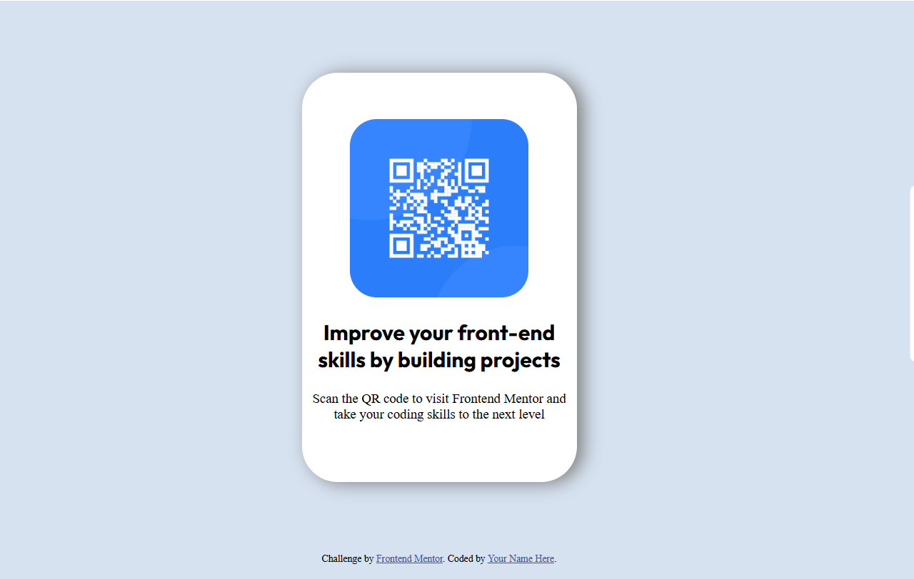

# QR-code-component-solution<br>
 This is a solution to the [QR code component challenge on Frontend Mentor](https://www.frontendmentor.io/challenges/qr-code-component-iux_sIO_H). Frontend Mentor challenges help you improve your coding skills by building realistic projects. <br>
## Screenshot<br>


 <br>
 <br>

## My process

### Built with:
developed  with !HTML5 AND CSS3

### What I learned
I learned that for (centering) elements, you shouldn't rely on `margin` and `padding`. Instead, you should use:

```css
display: flex;
```

along with other properties to position content in the center of the screen, specifically:

```css
justify-content: center;
align-items: center;
```

After discovering the power of these properties, `margin` and `padding` became useless for centering elements.

### Useful resources
esse site me ajudou a lembrar de algums tags html: 

## Author
- Website - [nightfoxstarfox]([https://www.your-site.com](https://nightfoxstarfox.github.io/QR-code-component-solution/)
- Frontend Mentor - [@yourusername](https://www.frontendmentor.io/profile/yourusername)
- Twitter - [@yourusername](https://www.twitter.com/yourusername)
